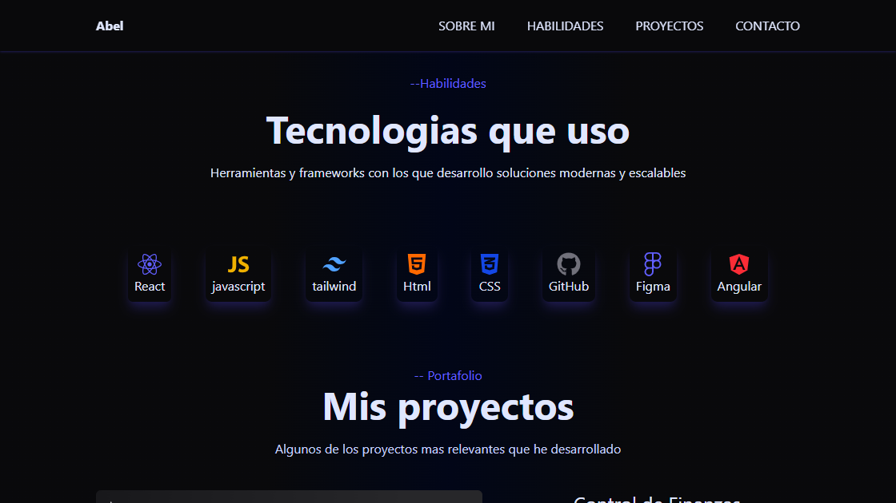

# 💼 Portafolio Web - Abel Pareja

Mi portafolio personal desarrollado con **React** donde presento mi perfil profesional, habilidades, proyectos y formas de contacto. El objetivo de este sitio es mostrar mi experiencia como desarrollador frontend y reunir en un solo lugar los proyectos que he desarrollado.

---

## 🚀 Demo

🌐 **Sitio Web:** https://TU-LINK-NETLIFY.netlify.app/

---

## 📸 Vista previa

  

---

## ✨ Características

- 👨‍💻 Presentación profesional.
- 📖 Sección "Sobre mí".
- 🛠 Tecnologías y habilidades.
- 🚀 Proyectos destacados.
- 📱 Diseño completamente responsive.
- 🎨 Interfaz moderna y minimalista.
- 📬 Información de contacto.

---

## 🛠 Tecnologías utilizadas

- React
- JavaScript (ES6+)
- Tailwind CSS
- React Icons
- Vite
- CSS3
- Git & GitHub
- Figma

---

## 📚 Lo que aprendí

Durante el desarrollo de este proyecto reforcé conocimientos sobre:

- Arquitectura de aplicaciones con React.
- Componentes reutilizables.
- Diseño responsive con Tailwind CSS.
- Organización de proyectos escalables.
- Optimización de la experiencia de usuario.
- Animaciones e interfaces modernas.
- Buenas prácticas de desarrollo frontend.
- Despliegue de aplicaciones con Netlify.

---

## 🚀 Próximas mejoras

- 🌐 Internacionalización (Español / Inglés).
- 🌙 Modo claro y oscuro.
- 📊 Más proyectos.
- ✨ Nuevas animaciones.
- 📝 Blog personal.
- 📧 Formulario de contacto funcional.
- 📈 Optimización SEO.

---

## 👨‍💻 Autor

### Abel Pareja

Desarrollador Frontend apasionado por la creación de interfaces web modernas, funcionales y responsivas utilizando React, JavaScript y Tailwind CSS.
